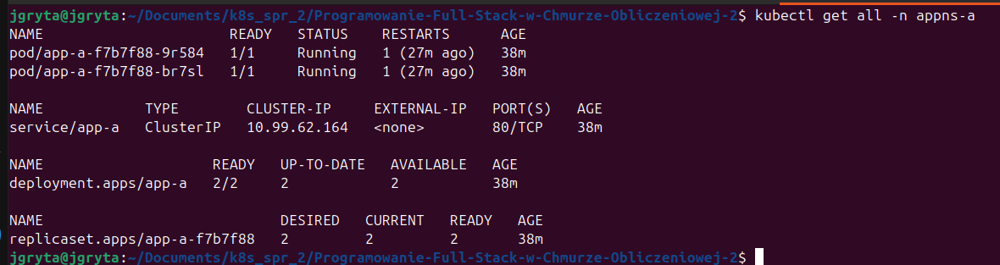
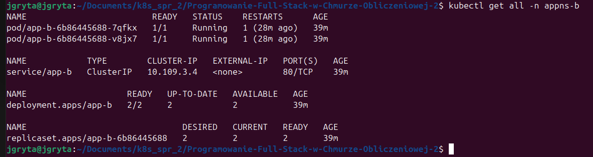
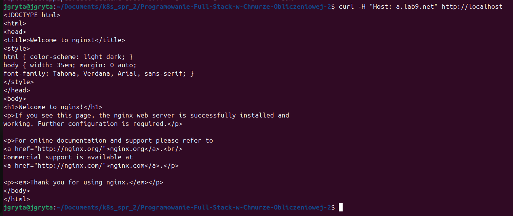
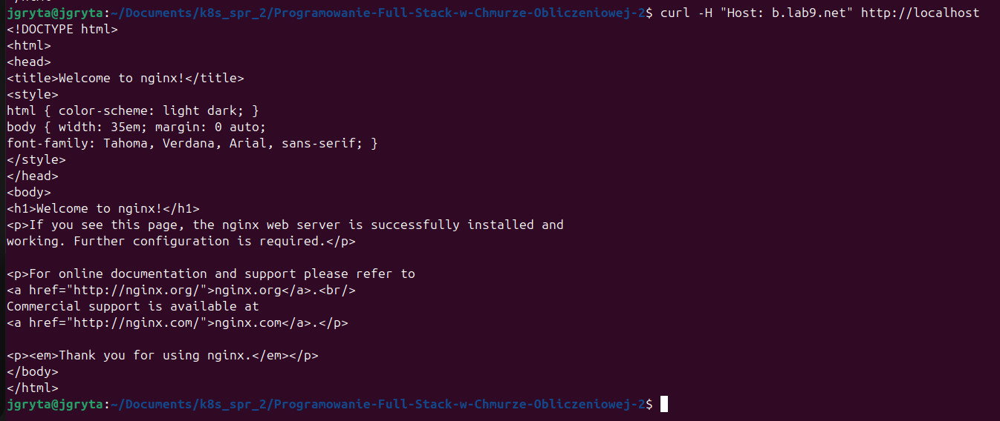
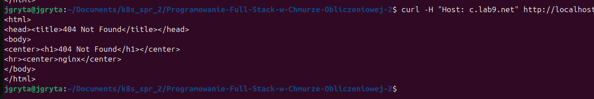

# Kubernetes Deployment and Configuration Documentation

This documentation describes the Kubernetes configuration and deployment for two applications (`app-a` and `app-b`) and their associated services, namespaces, network policies, and ingress. The configuration files are organized as follows:

## Configuration Files

### Namespaces
- **`appns-a.yaml`**: Defines the namespace `appns-a` for application `app-a`.
- **`appns-b.yaml`**: Defines the namespace `appns-b` for application `app-b`.

### Deployments
- **`app-a_dep.yaml`**: Deployment configuration for `app-a` with 2 replicas in the namespace `appns-a`.
- **`app-b_dep.yaml`**: Deployment configuration for `app-b` with 2 replicas in the namespace `appns-b`.
- **`default-backend_dep.yaml`**: Deployment configuration for the default backend service (`hello-api`) with 1 replica in the `default` namespace.

### Services
- **`app-a_sv.yaml`**: Service configuration for `app-a` to expose it within the namespace `appns-a`.
- **`app-b_sv.yaml`**: Service configuration for `app-b` to expose it within the namespace `appns-b`.
- **`default-backend_sv.yaml`**: Service configuration for the default backend service (`hello-api`) in the `default` namespace.

### Network Policies
- **`network-policy.yaml`**: NetworkPolicy configuration to:
  - Deny communication from any pod in `appns-a` to `appns-b`.
  - Deny communication from any pod in `appns-b` to `appns-a`.

### Ingress
- **`app-a_ing.yaml`**: Ingress configuration to:
  - Expose `app-a` at `a.lab9.net`.
- **`app-b_ing.yaml`** Ingress configuration to:
  - Expose `app-b` at `b.lab.net`.
- **`default-backend_ing.yaml`**: Ingress configuration to:
  - Redirect unmatched requests to the default backend service (`hello-api`).

## Deployment Instructions

### Steps to Deploy
1. **Create Namespaces**
   ```bash
   kubectl apply -f appns-a.yaml
   kubectl apply -f appns-b.yaml
   ```

2. **Deploy Applications**
   ```bash
   kubectl apply -f app-a_dep.yaml
   kubectl apply -f app-a_sv.yaml
   kubectl apply -f app-b_dep.yaml
   kubectl apply -f app-b_sv.yaml
   ```

3. **Deploy Default Backend**
   ```bash
   kubectl apply -f default-backend_dep.yaml
   kubectl apply -f default-backend_sv.yaml
   ```

4. **Apply Network Policies**
   ```bash
   kubectl apply -f network-policy.yaml
   ```

5. **Configure Ingress**
   ```bash
   kubectl apply -f app-a_ing.yaml
   kubectl apply -f app-b_ing.yaml
   kubectl apply -f default-backend_ing.yaml
   ```

### Verify the Deployment
1. **Check the Status of Deployments and Pods**
   ```bash
   kubectl get all -n appns-a
   kubectl get all -n appns-b
   kubectl get all -n default
   ```
   - **Namespace: appns-a**  
  

- **Namespace: appns-b**  
  

#### 2. **Access Applications via Ingress**

Test the application endpoints using a browser or `curl`.  

- **Access `app-a`**  
  URL: `http://a.lab9.net`  
  

- **Access `app-b`**  
  URL: `http://b.lab9.net`  
  

- **Test Unmatched Requests (Redirection)**  
  Example: `http://unmatched.lab9.net`  
  

